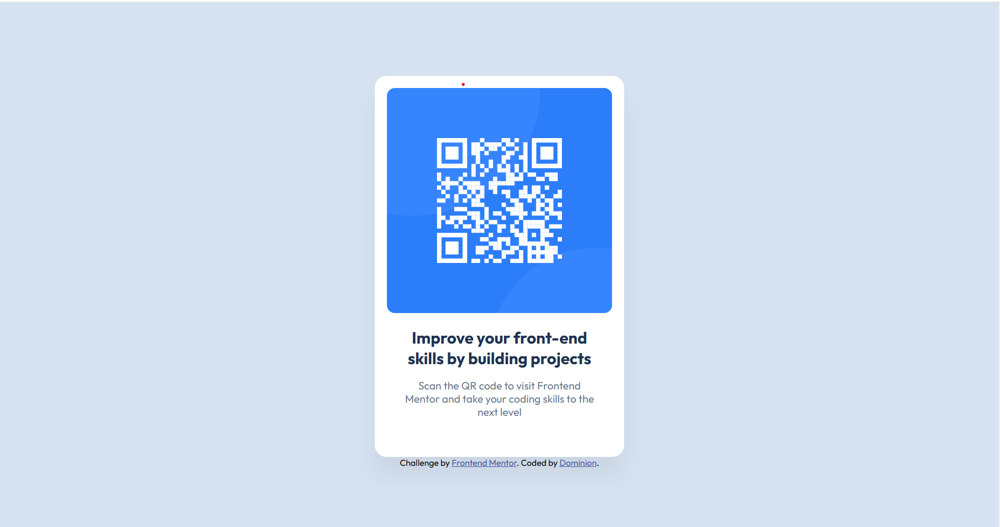

# Frontend Mentor - QR code component solution

This is a solution to the [QR code component challenge on Frontend Mentor](https://www.frontendmentor.io/challenges/qr-code-component-iux_sIO_H). Frontend Mentor challenges help you improve your coding skills by building realistic projects. 

## Table of contents

- [Overview](#overview)
  - [Screenshot](#screenshot)
  - [Links](#links)
- [My process](#my-process)
  - [Built with](#built-with)
  - [What I learned](#what-i-learned)
  - [Continued development](#continued-development)
  - [Useful resources](#useful-resources)
- [Author](#author)
- [Acknowledgments](#acknowledgments)

**Note: Delete this note and update the table of contents based on what sections you keep.**

## Overview

### Screenshot

### Links

- Solution URL: [https://github.com/why-not-phoenix/frontend-mentor-qr-code-component](https://github.com/why-not-phoenix/frontend-mentor-qr-code-component)
- Live Site URL: [https://why-not-phoenix.github.io/frontend-mentor-qr-code-component/](https://why-not-phoenix.github.io/frontend-mentor-qr-code-component/)

## My process

### Built with

- Semantic HTML5 markup
- CSS custom properties
- Flexbox

### What I learned

Although this may be considered one of the simpler challenges on the platform, it was particularly challenging for me, as I hadn't worked with HTML or CSS in over two years. At times, it was frustrating, and I found myself struggling with some of the basic concepts of these technologies. However, I was able to push through, and in doing so, I not only regained my skills but also learned a few new techniques along the way. I'm excited to continue tackling more challenges to further hone my skills and get back on track.

### Continued development

I'll be going on to tackle more advanced CSS and proceed to Javascript. I'd also like to practice Bootstrap and jQuery.

### Useful resources

- [Another Solution](https://qr-code-frontend-mentor-challenge-lovat.vercel.app/) - This served as a template to understand some key points I was missing and I was able to apply some ideas to my solution.

## Author

- Frontend Mentor - [@why-not-phoenix](https://www.frontendmentor.io/profile/why-not-phoenix)
- Twitter - [@dominion_onoja](https://x.com/dominion_onoja?t=RAWgmHy3YlUySDiPDnZS2g&s=09)

## Acknowledgments

Thank you Dias Adambekov.
